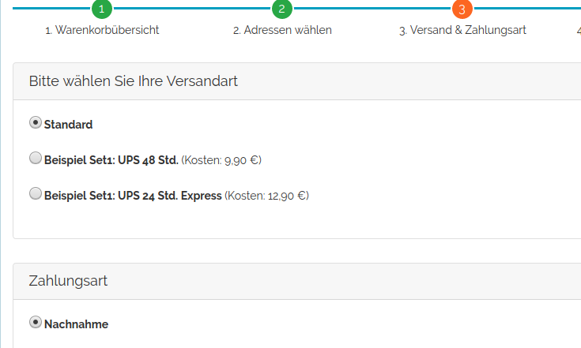

# Oxid delivery set list

## Description 

Display the delivery methods as list instead of a drop down

This module was created for Oxid 6.x, Wave Theme.

## Install

1. Copy files into following directory

        source/modules/rs/deliverysetlist
        
        
2. Add to composer.json at shop root
  
        "autoload": {
            "psr-4": {
                "rs\\deliverysetlist\\": "./source/modules/rs/deliverysetlist"
            }
        },

3. Refresh autoloader files with composer in the oxid root directory.

        composer dump-autoload
        
4. Enable module in the oxid admin area, Extensions => Modules